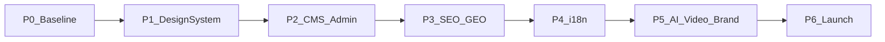

# Frontend implementation plan

**Product:** Gondar Simien Tours (operator: Simien Ethio Tours)  
**Approach:** Evolve the existing Next.js app — do not rebuild from scratch  
**Branch:** `frontend-imp`  
**Owner:** Frontend · Backend API owned separately in `../backend`

This document is the roadmap from the current baseline to a production-ready end product. Execute phases in order unless a later phase has an explicit parallel note.

---

## Baseline snapshot

### What already ships

| Area | Status |
| --- | --- |
| Public marketing site | Live routes for home, Simien, treks, Gondar, experiences, plan, gallery, reviews, legal |
| Inquiry planner | `/plan` + `app/api/inquiry` (mailto / optional webhook) |
| Admin shell | Login, dashboard, tour editor (deepest), other entity pages present |
| CMS client | `lib/cms.ts` — API-first with bundled TypeScript fallback |
| AI chat UI | `AssistantChat` → Express `/api/v1/assistant` when enabled |
| SEO foundations | Root metadata, some Open Graph, Organization JSON-LD, `sitemap.ts`, `robots.ts` |
| Design | Custom CSS tokens in `app/globals.css` (no Tailwind / shadcn yet) |
| i18n | `LanguageSwitcher` UI for EN/ES/DE/FR — not wired to real locales |

### Gaps to close

- Design system migration (Tailwind + shadcn)
- Complete, polished admin CRUD and inquiry → backend contact path
- Per-route SEO depth + GEO for AI search engines
- Real localization (`en` / `es` / `de` / `fr`)
- Production-ready AI UX, video surfaces, brand asset system
- Deploy, security, a11y, QA, and launch runbook

### Non-negotiables (all phases)

- No invented prices, review counts, wildlife guarantees, or unverified trail metrics
- Keep `/photo-credits` accurate
- Prefer CMS data when API is healthy; never break public pages if API is down
- Content rules: `research-notes.md`, `content-map.md`, `lib/site.ts`

---

## Roadmap overview

| Phase | Name | Outcome |
| --- | --- | --- |
| P0 | Baseline & DX | Reliable local + CI gates |
| P1 | Design system | Tailwind + shadcn, tokens mapped, incremental migration |
| P2 | CMS & admin | Admin CRUD solid; inquiries durable; less fallback reliance |
| P3 | SEO & GEO | Crawlable, answer-ready, performant pages |
| P4 | Localization | EN/ES/DE/FR for UI + key pages |
| P5 | AI, video, brand | Assistant converts; video/brand slots productionized |
| P6 | Launch | Staging → production checklist complete |

---

## P0 — Baseline & DX

### Goal

Every frontend contributor can run the app against the backend, ship with confidence, and follow content rules.

### Tasks

1. Document dual-process local setup (frontend `:3000`, backend `:5000`) in README if anything drifts — keep `.env.example` accurate.
2. Standardize local env: copy `.env.example` → `.env.local` with `NEXT_PUBLIC_API_URL`, `NEXT_PUBLIC_SITE_URL`.
3. Treat `npm run lint` (`tsc --noEmit`) and `npm run build` as merge gates before PRs.
4. Smoke-check: home, one trek detail, `/plan`, `/admin/login` with backend up and with backend down (fallback still works).
5. Pin a short content-integrity checklist in PRs touching copy (link `research-notes.md`).

### Primary files / areas

- `README.md`, `.env.example`
- `package.json` scripts
- `lib/cms.ts`, `lib/site.ts`

### Acceptance criteria

- [ ] Fresh clone: install → env → `dev` works without mystery steps
- [ ] `lint` + `build` pass on clean `frontend-imp`
- [ ] Public site renders with backend stopped (bundled fallback)
- [ ] Public + admin work with backend running on `NEXT_PUBLIC_API_URL`

### Backend dependencies

- Backend reachable on documented port; CORS `FRONTEND_ORIGIN` includes `http://localhost:3000`

---

## P1 — Design system migration

### Goal

Introduce Tailwind CSS and shadcn/ui **without** a visual rewrite. Map existing brand tokens; migrate surfaces in order of risk.

### Tasks

1. Add Tailwind v4 (or project-standard v3) + PostCSS; keep `globals.css` as the source of CSS variables initially.
2. Map tokens into Tailwind theme / `@theme`:

   | Token | Role |
   | --- | --- |
   | `--ink`, `--ivory`, `--paper`, `--highland`, `--teal`, `--copper` | Brand palette |
   | `--serif`, `--sans` | Typography |
   | `--shell`, `--ease*` | Layout / motion |

3. Initialize shadcn; configure to use those tokens (avoid default purple/shadcn look).
4. Migration order (do not big-bang):
   1. Admin (`app/admin/*`, `components/admin/*`, `admin.css`)
   2. Shared chrome (`Header`, `Footer`, `FloatingContact`, buttons/links)
   3. Marketing sections page-by-page
5. Prefer shadcn primitives for forms, dialogs, selects, toasts in admin; keep marketing editorial layout character.
6. After each slice: visual check desktop + mobile; remove dead CSS only when a surface is fully migrated.

### Primary files / areas

- `app/globals.css`, `app/admin/admin.css`
- `components/admin/*`, `app/admin/*`
- `components/Header.tsx`, `Footer.tsx`, form components
- New: `components/ui/*` (shadcn), Tailwind config / CSS entry

### Acceptance criteria

- [x] Tailwind + shadcn installed and used in admin without breaking login/dashboard/tours
- [x] Brand colors/fonts match current look (no generic shadcn theme takeover)
- [x] Marketing homepage still matches current composition after chrome migration
- [x] No duplicate conflicting global button systems left undocumented

### Backend dependencies

- None

---

## P2 — CMS & admin completion

### Goal

Admin is usable for day-to-day content ops; public content prefers API; inquiry path is reliable.

### Tasks

1. Harden each admin area to the same bar as tours:
   - Destinations, gallery, testimonials, blog, blog-categories
   - Bookings, contacts, subscribers
2. Consistent patterns: loading, empty, error, success toast, optimistic-safe mutations via `lib/admin/client.ts`.
3. Tour editor polish: validation feedback, publish/unpublish clarity, image upload UX against backend upload routes.
4. Inquiry path:
   - Prefer posting contacts to backend when API is up
   - Keep mailto/webhook fallback for resilience
   - Align payload fields with backend `Contact` model
5. CMS consumption:
   - Expand `lib/cms.ts` coverage where pages still hardcode only bundled data
   - Keep fallbacks until seed + publish workflow is stable in staging
6. Auth UX: expired session → login redirect; clear unauthorized errors.

### Primary files / areas

- `app/admin/**`, `components/admin/**`
- `lib/admin/client.ts`, `lib/cms.ts`, `lib/api/client.ts`
- `components/InquiryForm.tsx`, `app/api/inquiry/route.ts`
- `app/plan/page.tsx`

### Acceptance criteria

- [ ] Admin can CRUD all listed entities without console errors
- [ ] Published tour/testimonial changes appear on public site when API is healthy
- [ ] Inquiry creates a backend contact (or documented fallback fires) with required fields
- [ ] Empty/error/loading states exist on every admin list page

### Backend dependencies

- Stable admin auth cookies (CORS + `COOKIE_SECURE` for each environment)
- Upload + CRUD endpoints for gallery/tours/etc.
- Contact create endpoint (or agreed webhook contract)
- Seed data for staging parity with bundled fallbacks

---

## P3 — SEO & GEO

### Goal

Search engines and AI answer engines can correctly understand the operator, destinations, and journeys — without invented claims.

### Tasks

1. **On-page / technical SEO**
   - Unique `generateMetadata` (title, description, canonical) on every public route
   - Open Graph + Twitter cards; absolute URLs via `NEXT_PUBLIC_SITE_URL`
   - Keep `sitemap.ts` / `robots.ts` in sync with routes and locales (update again in P4)
2. **Structured data**
   - Organization / LocalBusiness where facts are verified
   - Tour/Trip JSON-LD only from real itinerary fields
   - FAQ schema only for real Q&A content
3. **GEO (generative engine optimization)**
   - Clear entity naming: Gondar Simien Tours / Simien Ethio Tours / Gondar / Simien Mountains
   - Answer-style sections (who we are, where we operate, how planning works)
   - Crawlable itinerary outlines; no thin doorway pages
   - Consistent NAP (name, address, phone) from `lib/site.ts`
4. **Performance (CWV)**
   - Next/Image everywhere practical; sized heroes
   - Font loading strategy (already Fontsource — avoid layout shift)
   - Lazy non-critical client widgets (chat, carousels)

### Primary files / areas

- `app/**/page.tsx` metadata exports
- `app/layout.tsx`, `app/sitemap.ts`, `app/robots.ts`
- `lib/site.ts`, itinerary/CMS detail pages

### Acceptance criteria

- [ ] No public indexable page missing unique title/description
- [ ] Canonical domain matches production `NEXT_PUBLIC_SITE_URL`
- [ ] JSON-LD validates for Organization + at least one Tour page
- [ ] Lighthouse/CWV: no major LCP regressions vs baseline on home + trek detail

### Backend dependencies

- Published CMS fields that match what we expose in metadata/JSON-LD
- Stable public URLs for uploaded images (or keep using `/public` until Cloudinary exists)

---

## P4 — Localization (EN / ES / DE / FR)

### Goal

Real multi-language site for UI chrome and high-traffic pages. CMS multi-locale content waits on backend support.

### Locked strategy

1. **First:** UI strings + static marketing copy via `next-intl` (App Router locale segment or equivalent)
2. **Later:** CMS locale fields after backend adds them — keep English CMS/bundled content as default until then

### Tasks

1. Add `next-intl` (or equivalent App Router i18n) with locales `en`, `es`, `de`, `fr`; default `en`.
2. Restructure routes under `[locale]` **or** adopt the library’s recommended Next 16 pattern without breaking admin (`/admin` stays locale-agnostic unless needed).
3. Extract strings: nav, footer, buttons, form labels, common CTAs.
4. Translate priority pages: home, treks index + key trek, about, plan, Simien destination.
5. Wire `LanguageSwitcher` to real locale navigation (replace any translate-widget hack).
6. Add `hreflang` alternates + localized metadata.
7. Update sitemap for locale variants.

### Primary files / areas

- `components/LanguageSwitcher.tsx`, `Header.tsx`, `Footer.tsx`
- `app/` routing layout
- New: `messages/en.json` (and `es`, `de`, `fr`)
- `app/sitemap.ts`, metadata helpers

### Acceptance criteria

- [ ] User can switch EN ↔ ES ↔ DE ↔ FR and see translated chrome on priority pages
- [ ] Direct URL to `/es/...` (or chosen pattern) works and is indexed in sitemap
- [ ] Admin remains usable (English is acceptable for admin v1)
- [ ] Missing translation falls back to English without crashing

### Backend dependencies

- None for UI-first i18n
- Later: locale columns / locale query params on tours, testimonials, blog

---

## P5 — AI assistant, video, brand

### Goal

Assistant helps convert; video and brand assets have production homes.

### Tasks

#### AI travel assistant

1. Production UX: loading, stream errors, rate-limit / disabled messaging when `ASSISTANT_ENABLED` is false.
2. Lead handoff: suggested replies → `/plan` with prefilled journey/subject.
3. Keep answers grounded (backend context-builder); frontend must not invent itinerary facts in UI copy around the widget.
4. Mobile: non-blocking chat sheet; respects safe areas.

#### Video

1. Define placements: homepage atmospheric (optional), about/operator, trek or photography pages.
2. Implement accessible embeds (poster, captions if provided) — **assets supplied by client/production**, not fabricated.
3. Lazy-load players; no autoplay audio.

#### Brand / logo

1. Inventory current mark (`BrandMark`, public logo assets).
2. Add SVG/primary lockups when delivered; document usage (light/dark, clear space) in a short `docs/brand.md` or README section.
3. Ensure favicon / apple-icon / OG image set is consistent.

### Primary files / areas

- `components/AssistantChat.tsx`
- Homepage / about / photography sections for video slots
- `components/BrandMark.tsx`, `app/icon.png`, `public/images/*`

### Acceptance criteria

- [ ] Assistant usable end-to-end when backend assistant is enabled
- [ ] Clear UI when assistant is disabled or quota hit
- [ ] Video slots render only with real assets; pages fine without them
- [ ] Brand mark/favicon consistent across marketing chrome

### Backend dependencies

- `ASSISTANT_ENABLED`, provider keys, streaming SSE CORS
- Optional: contact/lead capture from chat transcripts (if product wants it)

---

## P6 — Production launch

### Goal

Ship a stable production frontend with staging rehearsal and a clear cutover.

### Tasks

1. **Environments**
   - Staging + production env matrix: `NEXT_PUBLIC_SITE_URL`, `NEXT_PUBLIC_API_URL`, `CONTACT_WEBHOOK_URL`
2. **Security / integration**
   - Confirm cookie auth works cross-origin or same-site as designed with backend
   - No secrets in client bundle beyond `NEXT_PUBLIC_*`
3. **Accessibility**
   - Keyboard nav, focus states, skip link, form labels, contrast on migrated UI
4. **QA checklist**
   - Mobile + desktop: home, trek detail, plan submit, admin login + tour publish
   - Locale switch smoke (P4)
   - Assistant smoke (P5) on staging
5. **Performance budget**
   - Agree targets (e.g. LCP on 4G for home); fix regressions before go-live
6. **Cutover**
   - DNS / hosting (Vercel or agreed host)
   - Post-deploy: sitemap ping, spot-check metadata, admin login, one inquiry test
7. **Monitoring**
   - Error tracking (e.g. basic logging or agreed tool)
   - Uptime on `/` and backend `/health`

### Primary files / areas

- Hosting config, env docs in README
- `next.config.ts` (images domains for CMS uploads)
- Final QA notes (can live as checklist section below)

### Acceptance criteria

- [ ] Staging signed off on QA checklist
- [ ] Production deploy green; `NEXT_PUBLIC_SITE_URL` matches live domain
- [ ] Inquiry + admin + key marketing paths verified on production
- [ ] Rollback path documented (previous deploy)

### Backend dependencies

- Production API URL, CORS origins, secure cookies, email/assistant flags set by backend owner
- Database migrations deployed before frontend cutover that depends on new fields

---

## Definition of done (end product)

The frontend is **production-ready** when all of the following are true:

1. Public site and admin are deployed and verified on the production domain  
2. Tailwind/shadcn design system is in place for admin + shared chrome (marketing may still retain some legacy CSS during late migration, but new work uses the system)  
3. CMS-backed content path works; fallbacks remain as safety net  
4. SEO/GEO baseline met (metadata, sitemap, structured data, entity-consistent copy)  
5. EN/ES/DE/FR localization live for UI and priority pages  
6. AI assistant works when backend enables it, with sane failure UX  
7. Video/brand: real assets integrated or explicitly deferred with placeholders that do not claim unfinished media  
8. Content integrity rules still hold; photo credits intact  

---

## Out of scope (frontend plan)

| Item | Owner |
| --- | --- |
| Prisma schema, migrations, API routes | Backend |
| SMTP / Resend configuration | Backend / ops |
| Cloudinary (or remote storage) implementation | Backend (`STORAGE_DRIVER`) |
| Filming / editing promotional video | Client / production vendor |
| Inventing reviews, prices, or partnerships | Nobody — not allowed |

---

## Suggested sequence for day-to-day work

1. Finish P0 in one short pass  
2. Land P1 admin Tailwind/shadcn slice before large admin UX work (P2)  
3. Run P2 and P3 in parallel only after P1 admin foundation exists — SEO metadata can start early on pages not being restyled  
4. P4 after information architecture is stable (avoid translating throwaway strings)  
5. P5 when backend assistant + media assets are available  
6. P6 as a dedicated launch week, not mixed with feature spikes  

---

## Quick reference — key frontend paths

| Path | Role |
| --- | --- |
| `app/` | Routes, layouts, metadata, admin, inquiry API |
| `components/` | Marketing + admin UI |
| `lib/cms.ts` | API + fallback content layer |
| `lib/site.ts` | Brand / contact / journey cards |
| `lib/admin/client.ts` | Authenticated admin fetch |
| `app/globals.css` | Current design tokens and marketing CSS |
| `README.md` | Setup and stack notes |

Update this file when a phase completes: mark acceptance criteria done and note any scope changes agreed with the backend owner.
